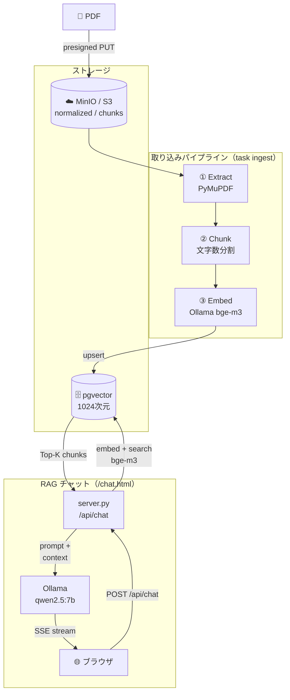

# biblio-rag — 日本語書籍 RAG パイプライン

購入済みの日本語 PDF 書籍を入力に、RAG の検索対象となるベクトルインデックスを構築する**取り込みパイプライン**。
`PDF → 抽出 → チャンク → 埋め込み → pgvector 格納 → 最小検索` までを対象とする（回答生成 LLM はスコープ外）。

- **開発**: ローカル完結（無料）— Ollama `bge-m3` + Docker pgvector
- **本番**: AWS（ECS Fargate + Lambda + SQS + Aurora pgvector + Bedrock Titan V2）※2nd ステージ
- 詳細設計は [`docs/design.md`](docs/design.md)、意思決定の経緯は [`docs/adr/`](docs/adr/) を参照

> **現在のステータス: MVP 完了（T1〜T5）＋ローカル RAG チャット UI＋精度改善・書籍管理機能。** ローカルで PDF→抽出→チャンク→埋め込み→pgvector→検索の縦串が通り、Ollama を使ったチャット UI（`/chat.html`）から質問できる。検索精度改善（Rerank/Hybrid/HyDE/Citation/スコア閾値判定/隣接チャンク展開）・書籍単位の絞り込み検索・書籍削除・取り込みステータス永続化・構造化ログ／ヘルスチェックをフラグ・API で提供。非同期化・AWS 化は 2nd ステージ。

> 🚀 **すぐ動かしたい人は [docs/quickstart.md](docs/quickstart.md)** へ（同梱の著作権フリーPDFで検索結果まで一気通貫）。

---

## アーキテクチャ



---

## 必要なツール（前提）

| ツール | 用途 | 確認 |
|---|---|---|
| [uv](https://docs.astral.sh/uv/) | Python 依存管理（**npm は使わない方針**） | `uv --version` |
| Python 3.14 | uv が自動取得（`.python-version` で固定） | — |
| Docker | pgvector / Ollama を起動（T1〜） | `docker --version` |
| [Ollama](https://ollama.com/) | 埋め込みモデル `bge-m3` の API 提供（T4〜） | `ollama --version` |
| [go-task](https://taskfile.dev/) | よく使うコマンドの短縮（`brew install go-task`） | `task --version` |
| [gitleaks](https://github.com/gitleaks/gitleaks) | コミット前の秘密情報検出（`brew install gitleaks`） | `gitleaks version` |
| [pre-commit](https://pre-commit.com/) | フック管理（`uv tool install pre-commit`） | `pre-commit --version` |

---

## セットアップ

```bash
# 1) 依存を同期（Python 3.14 を uv が用意し .venv を作成）
uv sync

# 2) 環境変数ファイルを用意（実値はコミットされない）
cp .env.example .env

# 3) 秘密情報ブロックのフックを有効化（必須）
uv tool install pre-commit   # 未導入の場合
brew install gitleaks        # 未導入の場合
pre-commit install
pre-commit run --all-files   # 初回フルスキャンで動作確認
```

### 開発スタックの起動（T1）

```bash
task up               # DB(pgvector)・Ollama・MinIO を起動（スキーマ/バケットは初回に自動適用）
task pull-model       # 埋め込みモデル bge-m3 を取得（約 1.2GB・初回のみ）
task pull-chat-model  # チャットモデル qwen2.5:7b を取得（約 4.7GB・初回のみ）

# 動作確認（1024 次元のベクトルが返る）
curl http://localhost:11434/api/embed -d '{"model":"bge-m3","input":"テスト"}'
# MinIO コンソール: http://localhost:9001 （minioadmin / minioadmin）
```

> **⚠️ macOS のポート衝突注意:** brew 版 Ollama を起動していると 11434 が衝突する。docker 版を使う間は native を止める（`brew services stop ollama` またはアプリ終了）。
> **⚠️ パフォーマンス:** Docker 内 Ollama は Metal GPU を使えず CPU 動作。速度を優先したい場合は native Ollama に切り替える構成も可。

停止 / 破棄:
```bash
task down                                               # 停止（データは保持）
docker compose -f docker/docker-compose.yml down -v    # ボリューム含め破棄（スキーマ再適用したい時）
```

---

## パイプライン実行（MVP）

PDF は **MinIO(S3) の `raw/`** にアップロードし、`title`/`author` を指定して直列実行する。
（`book_id` はファイル名 stem。実データは MinIO/S3 上にのみ存在し git 管理外）

```bash
# 1) PDF を S3(MinIO) にアップロード（書誌情報を S3 object metadata に記録）
task upload -- your_book.pdf --title "書名" --author "著者名"

# 2〜4) extract → chunk → embed を一括実行
task ingest

# 5) 検索
task search -- "調べたいこと" --top-k 5
```

ステップを個別に実行したい場合:
```bash
task extract   # ① S3(raw/) の PDF → S3(normalized/)
task chunk     # ② S3(normalized/) → S3(chunks/)
task embed     # ③ S3(chunks/) → pgvector
```

**増分実行**: 処理済みはスキップ。全件作り直す（洗い替え）ときは `--force`:
```bash
task chunk -- --force   # 全 md を再チャンク
task embed -- --force   # 全 book を再埋め込み
```

**既存 PDF のメタデータを後から登録**（古いアップロード等で title/author が未設定の場合）:
```bash
task upload -- --book-id mybook --title "書名" --author "著者名"
```

## WebUI

Starlette ベースの最小 Web アプリ。**アップロード**と**RAG チャット**の 2 機能を持つ。

```bash
task up     # MinIO / pgvector / Ollama を起動
task webui  # http://localhost:8000
```

### アップロード（`/`）

ブラウザから PDF を S3(MinIO) へ presigned URL で直接 PUT する。
PDF・書名・著者を入力 → `raw/<file>.pdf` が S3 に作られ、書誌情報は S3 object metadata に記録される。
あとは `task ingest` で埋め込みまで一気通貫。

### RAG チャット（`/chat.html`）

取り込み済みの書籍に対してチャットで質問できる最小 UI。

- **Ollama でストリーミング生成**（`qwen2.5:7b` デフォルト。`CHAT_MODEL` で変更可）
- ページ右上でペルソナ（優しい先輩 / 厳しい先生 / やさしく説明）・言語（日本語 / English）・**対象書籍**（全書籍 or 書籍単位で絞り込み）を切替可
- 生成中断ボタン（AbortController）でストリーミングをキャンセル可能
- 回答の根拠チャンクを「ソース」チップで表示。クリックで原文モーダルを開く
- 会話履歴を localStorage に保持（ページリロード後も復元）
- Markdown レンダリング対応（marked.js、DOMPurify でサニタイズ）
- **検索精度改善フラグ**（すべてオプション・`.env` で有効化。詳細は [ADR 0013](docs/adr/0013-rag-precision-improvements.md)）:
  - `RERANK_ENABLED`: クロスエンコーダ（`bge-reranker-v2-m3`）で候補 `RERANK_CANDIDATE_K`（デフォルト 20）件から上位 top_k 件を再スコアリング
  - `HYBRID_ENABLED`: pg_bigm キーワード検索と RRF 融合
  - `HYDE_ENABLED`: 仮説回答生成でクエリを書き換えてから検索
  - `CITATION_ENABLED`: 回答内に `[1][2]` の引用番号を付与
  - `SCORE_THRESHOLD_ENABLED`: ベクトル類似度が閾値未満の場合、LLM を呼ばず「該当情報なし」を返し幻覚を防ぐ
  - `ADJACENT_CHUNK_ENABLED`: ヒットしたチャンクの前後（`chunk_index` ±window）を追加取得し文脈を補う

```
http://localhost:8000/chat.html
```

> **速度について**: Docker 内 Ollama は Metal GPU が使えず CPU 動作。速度を優先するには
> native Ollama（`ollama serve`）を使い `OLLAMA_HOST=http://localhost:11434` を `.env` に設定する。

### 書籍管理（アップロード画面 `/`）

- 取り込み済み書籍の一覧を表示し、書籍単位で削除できる（`raw`/`normalized`/`chunks` の S3 ファイルと pgvector のチャンク・取り込みステータス履歴を横断して削除）
- 取り込み中（pending/processing）の書籍は削除不可（`_run_pipeline` との競合防止）

### 主な API エンドポイント

| エンドポイント | 用途 |
|---|---|
| `GET /api/health` | DB・Ollama の疎通確認（200=healthy / 503=unhealthy） |
| `POST /api/chat` | RAG チャット（SSE ストリーム）。`book_id` 指定で書籍を絞り込み検索 |
| `GET /api/books` | 取り込み済み書籍一覧（`book_id`/`title`/`author`） |
| `DELETE /api/books/{book_id}` | 書籍データの横断削除（S3 + pgvector + ステータス履歴） |
| `GET /api/ingest/{book_id}/status` | 取り込みステータス（PostgreSQL に永続化・プロセス再起動後も保持） |
| `GET /api/ingest/{book_id}/status/history` | 取り込みステータスの全遷移履歴 |

## セキュリティ / データ取り扱いルール（厳守）

このリポジトリは**パブリック公開前提**。以下を機械的・運用的に守る。

- **書籍データはコミットしない。** PDF 原本・抽出本文・チャンクはすべて**書籍本文を含む**ため `.gitignore` で `books/` ツリー全体を除外している。実データは MinIO/S3 上（`raw/` / `normalized/` / `chunks/`）にのみ存在する。
- **「正本」= git ではなく MinIO/S3。** `chunks/*.jsonl` 等の「正本」は再チューニング用の元データという意味で、保管先は MinIO/S3（開発・本番ともに S3 互換）。git では管理しない。
- **コミットしてよい本文は著作権フリー物のみ** — 青空文庫等を `tests/fixtures/` に置く。
- **AWS 実キーをローカルに置かない。** 開発は Ollama + Docker pgvector で完結するためダミーで足りる。本番 DB 認証は Secrets Manager。
- `.env` は `.gitignore` 済み。共有は `.env.example`（キー名のみ）で。
- **gitleaks + `check-added-large-files`** で秘密情報・大容量ファイルの誤コミットを二重ブロック。

### GitHub 公開時チェックリスト（リモート作成時に実施）

- [ ] リポジトリの **Secret Scanning** を有効化
- [ ] **Push Protection** を有効化（ローカルフックすり抜けの最終防壁）
- [ ] 公開前に `git log` / 履歴に書籍本文・キーが混入していないか確認

---

## 環境メモ（設計上の注意点）

| 項目 | メモ |
|---|---|
| Python 3.14 固定 | システム Python(3.9) は EOL 間近のため使わない。uv が 3.14 を管理。 |
| ライセンス | 本リポジトリのコードは **MIT**。ただし抽出に使う **PyMuPDF は AGPL**（再配布時は各依存のライセンスに従う。ローカル利用は問題なし）。 |
| 埋め込み次元 | 開発 bge-m3 / 本番 Titan V2 ともに **1024 次元**でスキーマ共通化。ただし意味空間は別物なので本番移行時は再埋め込みが必要。 |
| gitleaks フック | 公式フックは `go build` を伴うため、brew 版バイナリを `language: system` で呼ぶ構成にしている。 |

---

## 開発ルール

- コミットメッセージは **Conventional Commits** に統一。規約は [`docs/commit-convention.md`](docs/commit-convention.md)、実作業は `/commit` スキルが支援する。
- リンター/フォーマッターは **Ruff**。pre-commit で自動実行される。手動実行は以下。

```bash
task lint   # ruff check --fix && ruff format
task test   # pytest（e2e/localstack 除外）
```

- エージェント成果物（`.claude/skills/**/SKILL.md` 等）の脅威スキャンに **ATR** をローカル導入。
  npm 非依存（Docker）・外部送信ゼロ（オフライン）。詳細は [docs/atr.md](docs/atr.md)。

```bash
./scripts/atr-scan.sh      # ローカル・オフラインで SKILL.md をスキャン
```

## ディレクトリ構成（目標）

```
books/            # 書籍データ（.gitignore・コミット禁止）
                  #   実データは MinIO/S3 上（raw/ / normalized/ / chunks/）
                  #   books/ ローカルは空でよい（ローカル PDF 引数指定時のみ使用）
workers/
  extract/        # ① PyMuPDF 抽出
  chunk/          # ② チャンク（サイズ可変）
  embed/          # ③ 埋め込み + 格納（Embedder/VectorStore 抽象化）
  rerank/         # ④ クロスエンコーダ再スコアリング（オプション）
  storage/        # ObjectStore（S3/MinIO）+ StatusStore（取り込みステータス永続化）
webui/
  server.py       # Starlette アプリ（アップロード API + RAG チャット SSE + 書籍管理 API）
  logging_config.py # 構造化 JSON ログ設定
  static/
    index.html    # アップロード UI（書籍一覧・削除を含む）
    chat.html     # RAG チャット UI（書籍選択・生成中断を含む）
    chat.js       # チャット fetch/SSE クライアント
    app.js        # アップロード・書籍管理クライアント
infra/db/         # pgvector スキーマ（開発/本番共通）
docker/           # docker-compose.yml（postgres + Ollama）
tests/fixtures/   # 著作権フリーのテスト用データ（コミット可）
docs/
  design.md           # 確定した設計
  commit-convention.md # コミットメッセージ規約（正本）
  adr/                # アーキテクチャ決定記録
```

## ライセンス

[MIT](LICENSE)
